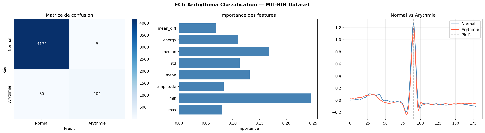

# ECG Arrhythmia Classification 🫀

Détection automatique d'arythmies cardiaques à partir de signaux ECG.

## Résultats
- **Accuracy : 99.2%**
- 21 561 battements analysés
- 10 enregistrements (MIT-BIH PhysioNet)

## Méthodologie
1. Chargement des signaux ECG (wfdb)
2. Filtrage passe-bande 0.5–50 Hz (scipy)
3. Segmentation des battements autour du pic R
4. Extraction de 8 features statistiques par battement
5. Classification Random Forest (scikit-learn)

## Dataset
MIT-BIH Arrhythmia Database — PhysioNet

## Stack technique
Python · wfdb · scikit-learn · scipy · matplotlib · seaborn

## Résultats visuels

